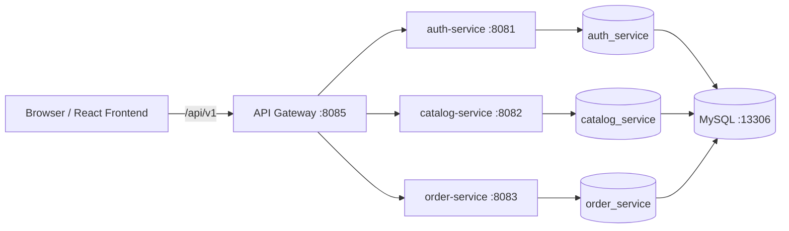
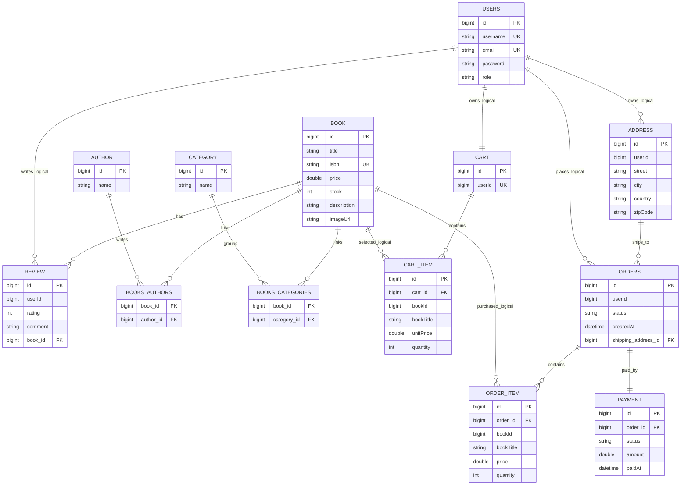

# Book Store

Am realizat o aplicatie web pentru administrarea unei librarii online. Proiectul este impartit in microservicii pentru autentificare, catalog, comenzi si rutare prin API Gateway, iar interfata este facuta separat in React.

## Repository-uri

- Backend / microservicii: `IonescuMihaiLeonard/Book-Store`
- Frontend React: `IonescuMihaiLeonard/Book-Store-FrontEnd`

## Tehnologii

Backend:

- Java 21
- Spring Boot 4
- Spring Web
- Spring Data JPA
- Spring Security
- JWT
- MySQL
- Spring Boot Actuator
- Maven
- Docker

Frontend:

- React
- Vite
- React Router
- JWT decode
- CSS modular pe pagini/componente

## Configurare Multi-Environment

Am configurat aplicatia cu doua profile Spring:

- `dev`: profilul folosit la rularea locala, cu MySQL
- `test`: profilul folosit la teste, cu H2 in-memory

In fiecare microserviciu, fisierul `application.yml` pastreaza setarile comune si seteaza profilul implicit:

```yaml
spring:
  profiles:
    default: dev
```

Configurarea pentru baza de date este separata pe medii:

- `application-dev.yml`: conexiune la MySQL
- `application-test.yml`: conexiune la H2

Pentru rularea normala a proiectului folosesc MySQL, ca datele sa ramana salvate intre porniri. Pentru teste folosesc H2, deoarece baza se creeaza rapid in memorie si se sterge automat dupa rularea testelor.

In scripturile Docker am setat explicit:

```text
SPRING_PROFILES_ACTIVE=dev
```

Testele pornesc cu:

```java
@ActiveProfiles("test")
```

Astfel pot demonstra separat mediul de dezvoltare si mediul de testare, fara sa am nevoie de o baza MySQL pornita pentru teste.

## Paginare si Sortare

Am adaugat paginare si sortare pe endpoint-urile principale de listare. Endpoint-urile raman compatibile cu frontend-ul: daca nu trimit parametri, primesc lista simpla ca inainte; daca trimit `page`, `size` sau `sort`, primesc un raspuns paginat.

Exemple:

```text
GET /api/v1/books?page=0&size=5&sort=title,asc
GET /api/v1/admin/books?page=0&size=10&sort=price,desc
GET /api/v1/admin/authors?page=0&size=10&sort=name,asc
GET /api/v1/admin/categories?page=0&size=10&sort=name,asc
GET /api/v1/admin/users?page=0&size=10&sort=username,asc
GET /api/v1/admin/orders?page=0&size=10&sort=createdAt,desc
```

Raspunsul paginat contine campuri precum `content`, `totalElements`, `totalPages`, `number` si `size`, ceea ce permite afisarea datelor pe pagini si ordonarea lor dupa campurile dorite.

## Logging

Am configurat logging pentru fiecare microserviciu si pentru API Gateway. Logurile apar in consola la rularea aplicatiei si sunt salvate separat in fisiere:

```text
logs/auth-service.log
logs/catalog-service.log
logs/order-service.log
logs/api-gateway.log
```

Nivelurile principale sunt:

- `root`: `INFO`
- `com.bookstore`: `INFO`
- `org.springframework.web`: `WARN`
- `org.hibernate.SQL`: `WARN` pentru serviciile care folosesc JPA

Am adaugat loguri pentru actiuni importante din aplicatie:

- inregistrare si autentificare utilizatori
- creare, modificare si stergere carti
- checkout comanda si modificare status comanda
- rutarea request-urilor prin API Gateway
- respingerea accesului fara token sau fara rol de admin

## Arhitectura

Am impartit aplicatia in trei microservicii de business si un API Gateway:

| Componenta | Port local | Responsabilitate |
| --- | ---: | --- |
| `auth-service` | `8081` | autentificare, inregistrare, utilizatori, roluri, JWT |
| `catalog-service` | `8082` | carti, autori, categorii, review-uri |
| `order-service` | `8083` | cos, adrese, comenzi, plati |
| `api-gateway` | `8085` | rutare centralizata, filtrare auth/admin, injectare `userId` |
| `frontend` | `5173` | interfata React pentru utilizatori si administratori |
| `mysql` | `13306` | baze de date pentru microservicii |



In frontend folosesc proxy-ul Vite pentru `/api/v1`, iar cererile ajung in `api-gateway`. Gateway-ul trimite mai departe cererile catre serviciul potrivit si verifica accesul la rutele de admin.

## Baze de Date

Fiecare microserviciu are baza lui:

- `auth_service`: utilizatori si roluri
- `catalog_service`: carti, autori, categorii si review-uri
- `order_service`: cosuri, adrese, comenzi, item-uri de comanda si plati

Am definit relatiile JPA directe in interiorul fiecarui microserviciu. Relatiile dintre servicii sunt pastrate prin identificatori logici, de exemplu `userId` si `bookId`, pentru a evita foreign key-uri intre baze de date diferite.

## Diagrama ERD



## Relatii JPA Acoperite

- `@OneToOne`: `Order` - `Payment`
- `@OneToMany` / `@ManyToOne`: `Cart` - `CartItem`, `Order` - `OrderItem`, `Address` - `Order`, `Book` - `Review`
- `@ManyToMany`: `Book` - `Author`, `Book` - `Category`

Entitati principale:

- `User`
- `Book`
- `Author`
- `Category`
- `Review`
- `Cart`
- `CartItem`
- `Address`
- `Order`
- `OrderItem`
- `Payment`

## Functionalitati

Utilizator:

- inregistrare cont
- autentificare cu JWT
- listare carti
- detalii carte
- adaugare produse in cos
- modificare cantitate in cos
- stergere produse din cos
- creare adresa
- checkout comanda
- vizualizare comenzi

Administrator:

- login cu rol `ADMIN`
- administrare carti
- administrare autori
- administrare categorii
- vizualizare utilizatori
- vizualizare comenzi
- modificare status comanda

## Securitate

- parole criptate cu BCrypt
- autentificare JWT
- roluri: `CUSTOMER`, `ADMIN`
- rute admin protejate in API Gateway
- logout in frontend prin stergerea tokenului
- gateway-ul blocheaza accesul la `/api/v1/admin/**` pentru utilizatorii fara rol `ADMIN`

Cont admin initial:

- username: `admin`
- password: `admin123`

## Structura Backend

```text
microservices/
  auth-service/
  catalog-service/
  order-service/
  api-gateway/
  pom.xml
```

## Structura Frontend

Am pus frontend-ul intr-un repository separat, dar el face parte din aceeasi aplicatie.

```text
Book-Store-FrontEnd/
  src/
    components/
    config/api.js
    pages/
    routes/
  vite.config.js
  package.json
```

Configurarea API in frontend:

- `VITE_API_BASE_URL=/api/v1`
- Vite proxy trimite `/api` catre `http://host.docker.internal:8085`

## Endpoint-uri Principale

Auth:

- `POST /api/v1/auth/register`
- `POST /api/v1/auth/login`
- `GET /api/v1/auth/validate?token=...`
- `GET /api/v1/auth/me`
- `GET /api/v1/admin/users`
- `GET /api/v1/admin/users/{id}`
- `POST /api/v1/admin/users`
- `PUT /api/v1/admin/users/{id}`
- `DELETE /api/v1/admin/users/{id}`

Catalog:

- `GET /api/v1/books`
- `GET /api/v1/books/{id}`
- `GET /api/v1/admin/books`
- `POST /api/v1/admin/books`
- `PUT /api/v1/admin/books/{id}`
- `DELETE /api/v1/admin/books/{id}`
- `GET /api/v1/admin/authors`
- `POST /api/v1/admin/authors`
- `PUT /api/v1/admin/authors/{id}`
- `DELETE /api/v1/admin/authors/{id}`
- `GET /api/v1/admin/categories`
- `POST /api/v1/admin/categories`
- `PUT /api/v1/admin/categories/{id}`
- `DELETE /api/v1/admin/categories/{id}`
- `GET /api/v1/books/{bookId}/reviews`
- `POST /api/v1/books/{bookId}/reviews`
- `GET /api/v1/admin/reviews`
- `GET /api/v1/admin/reviews/{id}`
- `POST /api/v1/admin/reviews`
- `PUT /api/v1/admin/reviews/{id}`
- `DELETE /api/v1/admin/reviews/{id}`

Orders:

- `GET /api/v1/cart`
- `POST /api/v1/cart/items`
- `PUT /api/v1/cart/items/{id}`
- `DELETE /api/v1/cart/items/{id}`
- `DELETE /api/v1/cart`
- `GET /api/v1/address`
- `POST /api/v1/address`
- `PUT /api/v1/address/{id}`
- `DELETE /api/v1/address/{id}`
- `POST /api/v1/orders/checkout`
- `GET /api/v1/orders`
- `GET /api/v1/admin/orders`
- `GET /api/v1/admin/orders/{id}`
- `POST /api/v1/admin/orders`
- `PUT /api/v1/admin/orders/{id}`
- `PUT /api/v1/admin/orders/{id}/status`
- `DELETE /api/v1/admin/orders/{id}`
- `GET /api/v1/admin/addresses`
- `GET /api/v1/admin/addresses/{id}`
- `POST /api/v1/admin/addresses`
- `PUT /api/v1/admin/addresses/{id}`
- `DELETE /api/v1/admin/addresses/{id}`
- `GET /api/v1/admin/carts`
- `GET /api/v1/admin/carts/{id}`
- `POST /api/v1/admin/carts`
- `PUT /api/v1/admin/carts/{id}`
- `DELETE /api/v1/admin/carts/{id}`
- `GET /api/v1/admin/cart-items`
- `GET /api/v1/admin/cart-items/{id}`
- `POST /api/v1/admin/cart-items`
- `PUT /api/v1/admin/cart-items/{id}`
- `DELETE /api/v1/admin/cart-items/{id}`
- `GET /api/v1/admin/order-items`
- `GET /api/v1/admin/order-items/{id}`
- `POST /api/v1/admin/order-items`
- `PUT /api/v1/admin/order-items/{id}`
- `DELETE /api/v1/admin/order-items/{id}`
- `GET /api/v1/admin/payments`
- `GET /api/v1/admin/payments/{id}`
- `POST /api/v1/admin/payments`
- `PUT /api/v1/admin/payments/{id}`
- `DELETE /api/v1/admin/payments/{id}`

## Rutare in API Gateway

- `/api/v1/auth/**` -> `auth-service`
- `/api/v1/books/**` -> `catalog-service`
- `/api/v1/admin/users` -> `auth-service`
- `/api/v1/admin/orders/**` -> `order-service`
- `/api/v1/admin/addresses/**` -> `order-service`
- `/api/v1/admin/carts/**` -> `order-service`
- `/api/v1/admin/cart-items/**` -> `order-service`
- `/api/v1/admin/order-items/**` -> `order-service`
- `/api/v1/admin/payments/**` -> `order-service`
- `/api/v1/admin/books/**` -> `catalog-service`
- `/api/v1/admin/authors/**` -> `catalog-service`
- `/api/v1/admin/categories/**` -> `catalog-service`
- `/api/v1/admin/reviews/**` -> `catalog-service`
- `/api/v1/address/**` -> `order-service`
- `/api/v1/cart/**` -> `order-service`
- `/api/v1/orders/**` -> `order-service`
