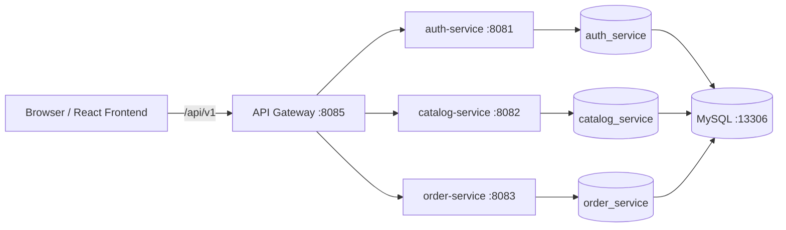
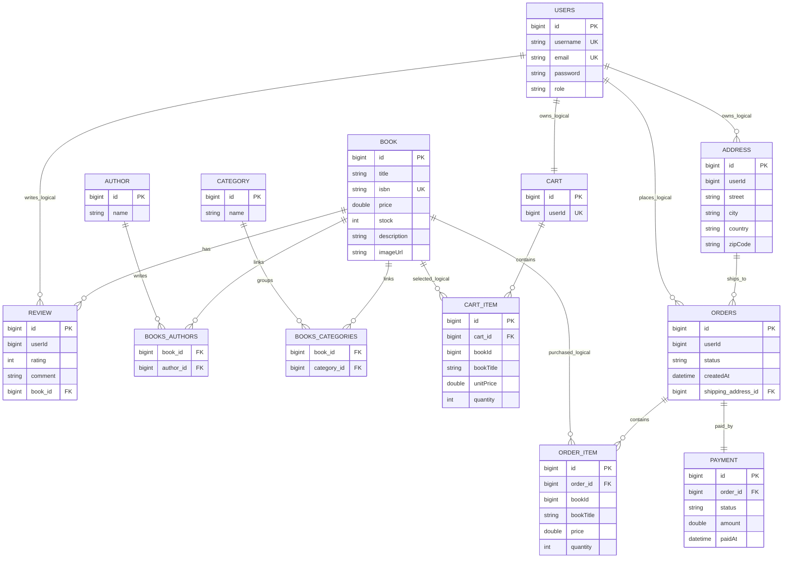

# Book Store

Aplicatie web pentru administrarea si vanzarea de carti, migrata de la o arhitectura monolitica la o arhitectura bazata pe microservicii.

Documentatia proiectului este pastrata intr-un singur loc: acest fisier `README.md`.

## Repository-uri

- Backend / microservicii: `IonescuMihaiLeonard/Book-Store`
- Frontend React: `IonescuMihaiLeonard/Book-Store-FrontEnd`

## Tehnologii

Backend:

- Java 21
- Spring Boot 4
- Spring Web
- Spring Data JPA
- Spring Security
- JWT
- MySQL
- Spring Boot Actuator
- Maven
- Docker

Frontend:

- React
- Vite
- React Router
- JWT decode
- CSS modular pe pagini/componente

## Arhitectura

Aplicatia este impartita in trei microservicii de business si un API Gateway:

| Componenta | Port local | Responsabilitate |
| --- | ---: | --- |
| `auth-service` | `8081` | autentificare, inregistrare, utilizatori, roluri, JWT |
| `catalog-service` | `8082` | carti, autori, categorii, review-uri |
| `order-service` | `8083` | cos, adrese, comenzi, plati |
| `api-gateway` | `8085` | rutare centralizata, filtrare auth/admin, injectare `userId` |
| `frontend` | `5173` | interfata React pentru utilizatori si administratori |
| `mysql` | `13306` | baze de date pentru microservicii |



Frontend-ul foloseste proxy-ul Vite pentru `/api/v1`, iar cererile ajung in `api-gateway`. Gateway-ul trimite mai departe cererile catre serviciul potrivit si verifica accesul la rutele de admin.

## Baze de Date

Fiecare microserviciu are baza lui:

- `auth_service`: utilizatori si roluri
- `catalog_service`: carti, autori, categorii si review-uri
- `order_service`: cosuri, adrese, comenzi, item-uri de comanda si plati

Relatiile directe JPA sunt definite in interiorul fiecarui microserviciu. Relatiile dintre servicii sunt pastrate prin identificatori logici, de exemplu `userId` si `bookId`, pentru a evita foreign key-uri intre baze de date diferite.

## Diagrama ERD



## Relatii JPA Acoperite

- `@OneToOne`: `Order` - `Payment`
- `@OneToMany` / `@ManyToOne`: `Cart` - `CartItem`, `Order` - `OrderItem`, `Address` - `Order`, `Book` - `Review`
- `@ManyToMany`: `Book` - `Author`, `Book` - `Category`

Entitati principale:

- `User`
- `Book`
- `Author`
- `Category`
- `Review`
- `Cart`
- `CartItem`
- `Address`
- `Order`
- `OrderItem`
- `Payment`

## Functionalitati

Utilizator:

- inregistrare cont
- autentificare cu JWT
- listare carti
- detalii carte
- adaugare produse in cos
- modificare cantitate in cos
- stergere produse din cos
- creare adresa
- checkout comanda
- vizualizare comenzi

Administrator:

- login cu rol `ADMIN`
- administrare carti
- administrare autori
- administrare categorii
- vizualizare utilizatori
- vizualizare comenzi
- modificare status comanda

## Securitate

- parole criptate cu BCrypt
- autentificare JWT
- roluri: `CUSTOMER`, `ADMIN`
- rute admin protejate in API Gateway
- logout in frontend prin stergerea tokenului
- gateway-ul blocheaza accesul la `/api/v1/admin/**` pentru utilizatorii fara rol `ADMIN`

Cont admin initial:

- username: `admin`
- password: `admin123`

## Structura Backend

```text
microservices/
  auth-service/
  catalog-service/
  order-service/
  api-gateway/
  pom.xml
start-dev.cmd
stop-dev.cmd
```

## Structura Frontend

Frontend-ul este in repository separat, dar face parte din aceeasi aplicatie.

```text
Book-Store-FrontEnd/
  src/
    components/
    config/api.js
    pages/
    routes/
  vite.config.js
  package.json
```

Configurarea API in frontend:

- `VITE_API_BASE_URL=/api/v1`
- Vite proxy trimite `/api` catre `http://host.docker.internal:8085`

## Pornire Locala

Prerequisites:

- Docker Desktop pornit
- porturile `5173`, `8081`, `8082`, `8083`, `8085`, `13306` libere

Pornire completa:

```powershell
.\start-dev.cmd
```

Oprire:

```powershell
.\stop-dev.cmd
```

URL-uri locale:

- Frontend: `http://localhost:5173`
- API Gateway: `http://localhost:8085`
- Auth service: `http://localhost:8081`
- Catalog service: `http://localhost:8082`
- Order service: `http://localhost:8083`
- MySQL: `localhost:13306`

## Endpoint-uri Principale

Auth:

- `POST /api/v1/auth/register`
- `POST /api/v1/auth/login`
- `GET /api/v1/auth/validate?token=...`
- `GET /api/v1/auth/me`
- `GET /api/v1/admin/users`
- `GET /api/v1/admin/users/{id}`
- `POST /api/v1/admin/users`
- `PUT /api/v1/admin/users/{id}`
- `DELETE /api/v1/admin/users/{id}`

Catalog:

- `GET /api/v1/books`
- `GET /api/v1/books/{id}`
- `GET /api/v1/admin/books`
- `POST /api/v1/admin/books`
- `PUT /api/v1/admin/books/{id}`
- `DELETE /api/v1/admin/books/{id}`
- `GET /api/v1/admin/authors`
- `POST /api/v1/admin/authors`
- `PUT /api/v1/admin/authors/{id}`
- `DELETE /api/v1/admin/authors/{id}`
- `GET /api/v1/admin/categories`
- `POST /api/v1/admin/categories`
- `PUT /api/v1/admin/categories/{id}`
- `DELETE /api/v1/admin/categories/{id}`
- `GET /api/v1/books/{bookId}/reviews`
- `POST /api/v1/books/{bookId}/reviews`
- `GET /api/v1/admin/reviews`
- `GET /api/v1/admin/reviews/{id}`
- `POST /api/v1/admin/reviews`
- `PUT /api/v1/admin/reviews/{id}`
- `DELETE /api/v1/admin/reviews/{id}`

Orders:

- `GET /api/v1/cart`
- `POST /api/v1/cart/items`
- `PUT /api/v1/cart/items/{id}`
- `DELETE /api/v1/cart/items/{id}`
- `DELETE /api/v1/cart`
- `GET /api/v1/address`
- `POST /api/v1/address`
- `PUT /api/v1/address/{id}`
- `DELETE /api/v1/address/{id}`
- `POST /api/v1/orders/checkout`
- `GET /api/v1/orders`
- `GET /api/v1/admin/orders`
- `GET /api/v1/admin/orders/{id}`
- `POST /api/v1/admin/orders`
- `PUT /api/v1/admin/orders/{id}`
- `PUT /api/v1/admin/orders/{id}/status`
- `DELETE /api/v1/admin/orders/{id}`
- `GET /api/v1/admin/addresses`
- `GET /api/v1/admin/addresses/{id}`
- `POST /api/v1/admin/addresses`
- `PUT /api/v1/admin/addresses/{id}`
- `DELETE /api/v1/admin/addresses/{id}`
- `GET /api/v1/admin/carts`
- `GET /api/v1/admin/carts/{id}`
- `POST /api/v1/admin/carts`
- `PUT /api/v1/admin/carts/{id}`
- `DELETE /api/v1/admin/carts/{id}`
- `GET /api/v1/admin/cart-items`
- `GET /api/v1/admin/cart-items/{id}`
- `POST /api/v1/admin/cart-items`
- `PUT /api/v1/admin/cart-items/{id}`
- `DELETE /api/v1/admin/cart-items/{id}`
- `GET /api/v1/admin/order-items`
- `GET /api/v1/admin/order-items/{id}`
- `POST /api/v1/admin/order-items`
- `PUT /api/v1/admin/order-items/{id}`
- `DELETE /api/v1/admin/order-items/{id}`
- `GET /api/v1/admin/payments`
- `GET /api/v1/admin/payments/{id}`
- `POST /api/v1/admin/payments`
- `PUT /api/v1/admin/payments/{id}`
- `DELETE /api/v1/admin/payments/{id}`

## Rutare in API Gateway

- `/api/v1/auth/**` -> `auth-service`
- `/api/v1/books/**` -> `catalog-service`
- `/api/v1/admin/users` -> `auth-service`
- `/api/v1/admin/orders/**` -> `order-service`
- `/api/v1/admin/addresses/**` -> `order-service`
- `/api/v1/admin/carts/**` -> `order-service`
- `/api/v1/admin/cart-items/**` -> `order-service`
- `/api/v1/admin/order-items/**` -> `order-service`
- `/api/v1/admin/payments/**` -> `order-service`
- `/api/v1/admin/books/**` -> `catalog-service`
- `/api/v1/admin/authors/**` -> `catalog-service`
- `/api/v1/admin/categories/**` -> `catalog-service`
- `/api/v1/admin/reviews/**` -> `catalog-service`
- `/api/v1/address/**` -> `order-service`
- `/api/v1/cart/**` -> `order-service`
- `/api/v1/orders/**` -> `order-service`

## Verificari Efectuate

Au fost testate urmatoarele fluxuri:

- pornire containere Docker
- health checks pentru servicii
- build frontend
- register/login user normal
- login admin
- listare carti prin gateway
- adaugare si modificare cart
- creare adresa
- checkout comanda
- golire cos dupa checkout
- listare comenzi
- acces admin pentru carti/autori/categorii/useri/comenzi
- update status comanda
- blocare acces admin pentru user normal cu `403`

## Cerinte Obligatorii - Stadiu Curent

| Cerinta | Status |
| --- | --- |
| Model de date cu minimum 6-7 entitati | Facut |
| Relatii `@OneToOne`, `@OneToMany/@ManyToOne`, `@ManyToMany` | Facut |
| Diagrama ERD in README | Facut |
| CRUD cu Spring Data JPA si service layer | Facut |
| Multi-environment dev/test | Nefacut |
| Testing unit/integration | Nefacut |
| Views si validare | Partial spre facut |
| Logging configurat | Nefacut |
| Paginare si sortare | Nefacut |
| Spring Security | Partial spre facut |

## Observatii

Monolitul initial a fost eliminat din repository-ul backend. Functionalitatea principala ruleaza prin microservicii si frontend-ul comunica exclusiv cu API Gateway-ul.
