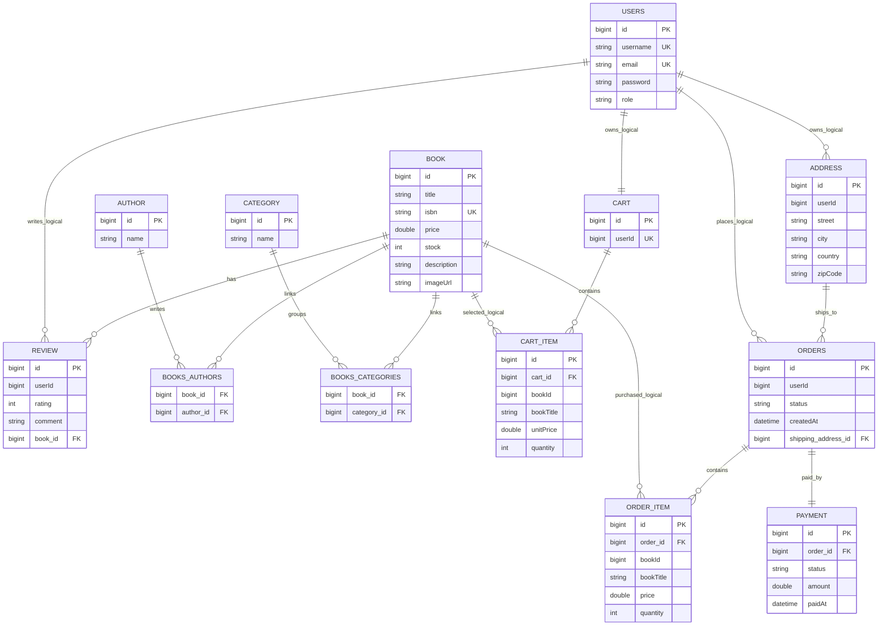

# Bookstore Microservices

Arhitectura extrasa din monolit pentru aplicatia BookStore.

## Servicii planificate

| Serviciu | Port | Responsabilitate |
| --- | ---: | --- |
| auth-service | 8081 | Register, login, users, JWT |
| catalog-service | 8082 | Books, authors, categories, reviews |
| order-service | 8083 | Cart, orders, payments, addresses |
| api-gateway | 8085 | Routing centralizat catre servicii |
## Etapa curenta

Frontend-ul foloseste `api-gateway` prin proxy-ul Vite (`/api/v1`). Domeniile de autentificare, catalog si comenzi sunt mutate in microservicii. Monolitul din `../backend` poate fi sters dupa confirmarea finala.

## Model de date si diagrama ER

Aplicatia foloseste trei baze de date separate, cate una pentru fiecare domeniu principal:

- `auth_service`: utilizatori si roluri
- `catalog_service`: carti, autori, categorii si review-uri
- `order_service`: cosuri, adrese, comenzi, produse comandate si plati

Relatiile directe JPA exista in interiorul fiecarui microserviciu. Relatiile dintre microservicii sunt pastrate prin identificatori (`userId`, `bookId`) pentru a evita dependente hard intre baze de date diferite.



Tipuri de relatii acoperite:

- `@OneToOne`: `Order` - `Payment`
- `@OneToMany` / `@ManyToOne`: `Cart` - `CartItem`, `Order` - `OrderItem`, `Address` - `Order`, `Book` - `Review`
- `@ManyToMany`: `Book` - `Author`, `Book` - `Category`

Entitati principale: `User`, `Book`, `Author`, `Category`, `Review`, `Cart`, `CartItem`, `Address`, `Order`, `OrderItem`, `Payment`.

## Auth service local

Ruleaza pe portul `8081` si foloseste baza MySQL `auth_service`:

```powershell
cd C:\Users\bondo\Documents\AWBD\microservices
.\start-auth-service.cmd
```

Endpointuri:

- `POST http://localhost:8081/api/v1/auth/register`
- `POST http://localhost:8081/api/v1/auth/login`
- `GET http://localhost:8081/api/v1/auth/validate?token=...`
- `GET http://localhost:8081/api/v1/auth/me`
- `GET http://localhost:8081/api/v1/admin/users`

Cont admin seed-uit automat:

- username: `admin`
- password: `admin123`

## Catalog service local

Ruleaza pe portul `8082` si foloseste baza MySQL `catalog_service`:

```powershell
cd C:\Users\bondo\Documents\AWBD\microservices
.\start-catalog-service.cmd
```

Endpointuri:

- `GET http://localhost:8082/api/v1/books`
- `GET http://localhost:8082/api/v1/books/{id}`
- `GET/POST/PUT/DELETE http://localhost:8082/api/v1/admin/books`
- `GET/POST/PUT/DELETE http://localhost:8082/api/v1/admin/authors`
- `GET/POST/PUT/DELETE http://localhost:8082/api/v1/admin/categories`
- `GET/POST http://localhost:8082/api/v1/books/{bookId}/reviews`

## Order service local

Ruleaza pe portul `8083` si foloseste baza MySQL `order_service`:

```powershell
cd C:\Users\bondo\Documents\AWBD\microservices
.\start-order-service.cmd
```

Endpointuri:

- `GET http://localhost:8083/api/v1/address?userId=1`
- `POST/PUT/DELETE http://localhost:8083/api/v1/address`
- `GET http://localhost:8083/api/v1/cart?userId=1`
- `POST/PUT/DELETE http://localhost:8083/api/v1/cart/items`
- `POST http://localhost:8083/api/v1/orders/checkout?userId=1`
- `GET http://localhost:8083/api/v1/orders?userId=1`
- `PUT http://localhost:8083/api/v1/orders/{id}/status?status=PLACED`
- `GET http://localhost:8083/api/v1/admin/orders`
- `PUT http://localhost:8083/api/v1/admin/orders/{id}/status?status=PLACED`

## API gateway local

Ruleaza pe portul `8085` si ruteaza cererile catre serviciile interne. Scripturile conecteaza serviciile in reteaua Docker `bookstore-net`, iar gateway-ul comunica intern prin numele containerelor.

```powershell
cd C:\Users\bondo\Documents\AWBD\microservices
.\start-api-gateway.cmd
```

Rute:

- `http://localhost:8085/api/v1/auth/**` -> `auth-service`
- `http://localhost:8085/api/v1/books/**` -> `catalog-service`
- `http://localhost:8085/api/v1/admin/users` -> `auth-service`
- `http://localhost:8085/api/v1/admin/orders/**` -> `order-service`
- `http://localhost:8085/api/v1/admin/books/**` -> `catalog-service`
- `http://localhost:8085/api/v1/admin/authors/**` -> `catalog-service`
- `http://localhost:8085/api/v1/admin/categories/**` -> `catalog-service`
- `http://localhost:8085/api/v1/address/**` -> `order-service`
- `http://localhost:8085/api/v1/cart/**` -> `order-service`
- `http://localhost:8085/api/v1/orders/**` -> `order-service`

Gateway-ul adauga automat `userId` pe rutele de cart/address/orders pe baza tokenului si blocheaza rutele `/api/v1/admin/**` pentru utilizatorii fara rol `ADMIN`.

Verificare rapida:

- `GET http://localhost:8085/api/v1/books`
